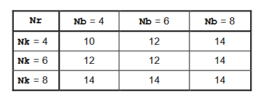

> [!IMPORTANT]
> This is not a crypto-secure implementation of AES (some of the arithmetic algorithms used are vulnerable through side channels, and key generation is not properly pseudo-random).

Implementation based primarily on material at https://csrc.nist.gov/csrc/media/projects/cryptographic-standards-and-guidelines/documents/aes-development/rijndael-ammended.pdf.

# A bit about AES (Rijndael)

## Mathematical Preliminaries
- For some operations, bytes represent elements in the Galois Field GF(28).
- For other operations, four-byte words are used.

### Operations on Galois Fields
- Addition can be implemented as a simple bitwise XOR.
- Multiplication of field elements can be implemented as carry-less muliplication (bitwise AND), follwed by a bitwise XOR with m(x) (the irreducible polynomial for the Galois Field).
- Muliplication by x can be implemented as a left shift and conditional bitwise XOR with m(x) (only perform the XOR if the degree of the polynomial is above 7).

### Operations on Polynomials with coefficients in GF(28)
- A four-byte word can be interpreted as four elements of GF(28); these elements correspond to a polynomial of degree below 4.
- Polynomial addition is performed by adding the coefficients (so, performing a bitwise XOR of the words representing the two polynomials).
- Multiplication of two polynomials must be performed modulo the degree 4 irreducible polynomial M(x), and can be implemented as a matrix multiplication. In this form, matrix A is a circular matrix containing the first polynomial, and matrix B is the second polynomial as a column vector; this representation relies on a property of M(x)=x4+1.
- Muliplication by x is performed modulo the same degree 4 polynomial M(x), and can also be represented as a matrix multiplication.

## Internal State
- An array of bytes, comprised of four rows, with a number of columns Nb equal to the block length divided by 32.

> [!NOTE]
> The specification of AES fixes a block size of 128 bits; these notes are based on the original specification of the Rijndael cipher, which allows any 32-byte divisible block size between 128 and 256.

- Cipher key is also an array of bytes; four rows, with the number of columns Nk equal to the key length divided by 32.
- Both of these state components are sometimes considered as a 1D array of four-byte vectors, where each vector corresponds to a column in the 2D array.

### Input and Output
- Inputs are one-dimensional arrays of 8-bit bytes numbered from 0 to 4*Nb-1 (and similarly for the key input).
- The cipher input bytes are mapped onto the internal state in column-major order. The output is then extracted from the final state in the same way.

## Round Function Structure
Composed of three layers; these are distinct, invertible, uniform transformations (technically not a Feistel structure). An additional Key Addition Layer is applied before the first round, and the linear mixing layer in the final round is different from the mixing layer in other rounds.

The number of rounds to use is calculated as a function of the key length and block length:

In a round, the transformations are applied in the following order:
1. Byte substitution (non-linear transformation)
2. Row shift
3. Column mix
4. Round key application

The final round omits the column mixing step.

### SubBytes (Non-Linear Layer)
Applies S-boxes in parallel across all state bytes.

The substitution table (S-box) is constructed from a composition of the following two transformations:
- Take the multiplicative inverse of the bytes in GF(28).
- Apply an affine defined by:

To invert the S-box, the inverse affine mapping is applied, and then the multiplicative inverse taken again.

### ShiftRows
Rows of the state are cyclically shifted over different offsets, which are determined by the block length:

- Row 0 is not shifted
- Row 1 is shifted C1 bytes
- Row 2 is shifted C2 bytes
- Row 3 is shifted C3 bytes

(The inverse of this transformation is just inverting the cyclic shifts.)

### MixColumns
For this transformation, the columns of the state are considered as polynomials over GF(28), and multiplied modulo M(x) (see earlier) with the fixed polynomial c(x):

This can be implemented as a matrix multiplication (see the Mathematical Preliminaries section).

The inverse transformation is a column-wise multiplication modulo M(x) by a different polynomial, d(x):

### AddRoundKey
Simple bitwise XOR with the round key.

## Key Schedule
The AES key schedule consists of two components: the Key Expansion, and the Round Key Selection. The total number of round key bits generated over an application of the cipher will be the block length, multiplied by the number of rounds plus one (to account for the initial round key application before any of the rounds begin). To obtain these bits, the cipher key is transformed into the expanded key, and these bits are used in sequence.

### Key Expansion
The Expanded Key is represented as a linear array of 4-byte words. The first Nk words are just the cipher key itself; all other words are defined recursively in terms of earlier words in the Expanded Key. This definition is different for Nk of 6 or less, and more than 6.

Note: this key expansion does not need to be done all at once, as subsequent words can only rely on at most the previous Nk words in the Expanded Key. Therefore, more of the Expanded Key can be generated on-the-fly as requred if a buffer of Nk words is retained. This may be particularly useful in RAM-limited applications.

# Implementation Approach
- Start with defining an interface for the state
- Implement each transformation step, operating on this state
- Implement the key schedule
- Implement the round function as a whole
- Add proper input and output handling
- Add some basic block cipher modes (e.g. ECB, CBC, GCM)
